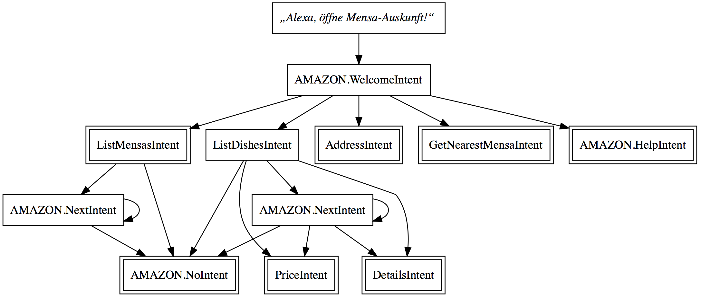

# Dokumentation des Skills "Mensa-Auskunft"
*Monique Noss*  
*Olha Zolotarenko*  
*Maria Lomaeva*  
*Bogdan Kostić*

## 1. Einleitung

_Alexa_, der sprachgesteuerte, digitale Assistent von Amazon, kann seinem Nutzer mit einer Bandbreite an Standardaufgaben wie der Wettervorhersage oder dem Stellen eines Timers helfen.
_Alexa_ ist jedoch dazu fähig, weit mehr als nur Standardaufgaben zu lösen.
Amazon bietet Softwareentwicklern und Drittanbietern nämlich die Möglichkeit, die Funktionen des digitalen Assistenten mit sogenannten Skills zu erweitern.
Die an uns gestellte Aufgabe war es also, einen eigenen Skill für _Alexa_ zu entwickeln.

Unser Skill stellt dem Nutzer Informationen über die Hochschulmensen Deutschlands bereit.
Der Nutzer kann mithilfe des Skills dementsprechend nach dem Speiseplan einer Mensa, der Adresse einer Mensa, einer Auflistung der Mensen in einer bestimmten Stadt sowie nach der zu ihm nächst gelegenen Mensa fragen.
Um diese Fragen beantworten zu können, konsultiert unser Skill die OpenMensaAPI, aus der die benötigten Informationen extrahiert werden.

## 2. Projektziele und Funktionen

Im Nachfolgenden werden die erreichten Projektziele und Anforderungen erläutert. Darüber hinaus werden die Funktionen des Skills anhand von Beispieldialogen gezeigt.

### 2.1 Anwendungsbereich und Zielgruppe
Bei einem Mensa-Skill, dessen Hauptaufgabe es ist, über den Essensplan einer Mensa zu informieren, sind vor allem Studierende, aber auch Dozierende die Zielgruppe.
Eine kleine, aber keinesfalls unwichtige Teilgruppe dieser doch recht großen Zielgruppe sind blinde Studierende und Beschäftigte der Universitäten.
Dieser Skill ermöglicht es Menschen mit Sehbehinderung leichter an Informationen über das Essensangebot an deutschen Hochschulen zu kommen und macht damit die deutsche Hochschullandschaft noch ein wenig barriefreier.

Eine weitere kleine Zielgruppe dieses Skills könnten Beschäftigte eines Studienakkreditierungsinstituts sein, die oft durch ganz Deutschland reisen und viel Zeit an den unterschiedlichsten Hochschulen verbringen.
Dementsprechend könnten diese Beschäftigte an den Speiseplänen vieler verschiedener Universitäten und Fachhochschulen interessiert sein.
Da wir versucht haben, die ganze Bandbreite der OpenMensa API zu nutzen und somit Informationen für 490 verschiedene Mensen bereitstellen können, ist dieser Skill dazu in der Lage, diesem Interesse entgegenzukommen.

Das Informationsbedürfnis dieser Zielgruppen ist es einerseits, eine grobe Übersicht über das Angebot zu erhalten, andererseits aber auch nach bestimmten Zutaten gefilterte Ergebnisse zu erhalten, falls Allergien oder besondere Ernährungsweisen vorliegen (z.B. Veganismus).
Auch der Preis eines bestimmten Gerichtes könnte für eine finale Auswahl entscheidend sein, da das Budget eines Studierenden selten großzügig ausfällt.
Diese und weitere verschiedene Funktionen wurden eingebaut, um die in der OpenMensa API angebotenen Daten ausgiebig zu nutzen. Dazu gehören auch die folgenden Lokationsfunktionen:

- Adresse von Mensen
- Koordinaten, um die nächste Mensa zu finden
- Mensen nach Stadt finden

Neben den oben genannten Funktionen, die durch selbsterstellte Intents des Skills umgesetzt wurden, bietet Amazon den Skill-Entwicklern an, dynamische, auf den Benutzer zugeschnittene Funktionen einzubauen. Ein Beispiel hierfür sind die "Persist Attributes" (= "bleibende Attribute"). Persist Attributes dienen dazu, bestimmte Daten in einer Session zu speichern, damit sie in der nächsten wieder abgerufen werden können. So müsste ein Benutzer nicht bei jedem Launch mit erwähnen, für welche Mensa ein Essensplan ausgegeben werden soll. Während die Implementierung und Einbettung über AWS DynamoDB einfach vorgenommen werden kann, könnten diese beim Entwickler Kosten verursachen, weshalb wir in diesem Skill auf die Benutzung dieser Attribute verzichtet haben. Auch könnten User Accounts angelegt werden, um persönliche Vorlieben des Users speichern zu können.

Eine weitere mögliche Verbesserung haben wir während der zweiten Projektphase, also nach der ersten Vorstellung der Projekte, umsetzen können. Es handelt sich hierbei um syntaktisches Parsing der Gerichte, um nur den Kopf der "Gerichtsphrase" auszugeben und somit die Antworten des Skills zu kürzen, um den Nutzer nicht mit Informationen zu überhäufen. Aus demselben Grund werden nun immer nur vier Gerichte in einem Prompt vorgelesen. Möchte der Nutzer weitere Gerichte erfahren, kann einfach "weiter" gescrollt werden. Mit einem Intent für Details können dagegen Details zu einem Gericht erfragt werden.

Für uns war es wichtig, die gesamte Breite der API zu nutzen, um dem Nutzer so viele Funktionen wie möglich zu bieten. Nichtsdestotrotz findet die In-App-Kommunikation schnell ein Ende, wenn der Benutzer ein mögliches Ziel erreicht hat oder ein Fehler aufgetreten ist. Der Skill kann dann in einem One-Shot erneut gelaunched werden.

### 2.2 Funktionsumfang und Beispieläußerungen
#### 2.2.1 Essensplan
Gibt den Essensplan einer bestimmten Mensa für ein bestimmtes Datum aus. Optional kann eine Zutat angegeben werden, die enthalten sein soll. 

Beispieläußerungen:

>"lies mir den plan für {date} vor"  
"gibt es {date} {ingredient} gerichte in der {mensa_name}"  
>"was gibt's in der mensa"  

##### 2.2.1.1 Gerichte ohne Zutat
Sucht Gerichte in einer bestimmten Mensa für ein bestimmtes Datum ohne bis zu zwei Zutaten. 

Beispieläußerungen:

>"suche für {date} {synonyms_gericht} ohne {ingredient} in {mensa_name}"  
"gibt es {date} {synonyms_gericht} ohne {ingredient}"  
>"nach {synonyms_gericht} ohne {ingredient} bitte"  

##### 2.2.1.2 Gerichte mit Zutat
Sucht Gerichte in einer bestimmten Mensa für ein bestimmtes Datum mit bis zu zwei Zutaten. 

Beispieläußerungen:

>"suche für {date} {synonyms_gericht} mit {ingredient} in {mensa_name}"  
"gibt es {date} {synonyms_gericht} mit {ingredient}"  
>"nach {synonyms_gericht} mit {ingredient} bitte"  

#### 2.2.2 Preis der Gerichte
Der Skill gibt den Preis für ein Gericht zurück.

Beispieläußerungen:

>"preis für nummer {number}"  
"wie viel kostet das {number} für {user_group}"  
>"wie teuer ist das {number} gericht"  

#### 2.2.3 Adresse der Mensa
Die Adresse einer Mensa wird vorgelesen. 

Beispieläußerungen:

>"zeige mir die adresse der {mensa_name}"  
"standort {mensa_name}"  
>"adresse {mensa_name}"  

#### 2.2.4 Mensas in einer Stadt
Listet die Mensas in einer genannten Stadt auf.

Beispieläußerungen:

>"welche mensas gibt es in {city}"  
"suche mensas in {city}"  
>"gibt es mensas in {city}"  

#### 2.2.5 Mensa in der Nähe
Findet die Mensa, die dem Benutzerstandort am nächsten ist.

Beispieläußerungen:

>"wo ist die nächste mensa"  
"ich bin hungrig"  
>"welche mensa ist in der nähe"  

### 2.3 Szenarien und Beispieldialoge

Im nachfolgenden Absatz werden Beispieldialoge für jeden Intent aufgelistet, die Skillerfolge und -misserfolge darstellen sollen, um die Funktionalität des Skills zu verdeutlichen. Diese werden jeweils anhand von spezifischen Szenarien veranschaulicht und erklärt.

#### 2.3.1 Beispieldialoge: Essensplan und Preise erfahren
Die am häufigsten genutzte Funktion eines Mensa-Skills wird voraussichtlich das Abfragen des Essensplans für einen bestimmten Tag in der eigenen Mensa sein. Hierbei kann der Nutzer Zutaten einzuschränken, um die Auswahl von Anfang an auszuschließen. Wenn eine Auswahl getroffen wurde, wird der Benutzer gefragt, ob er Details oder den Preis eines der Gerichte erfahren möchte. Der Benutzer kann an dieser Stelle auch verneinen, woraufhin der Skill geschlossen wird.

##### Szenario 1: Benutzer möchte den Essensplan für eine bestimmte Mensa, für einen bestimmten Tag erfragen.
Wann? Jederzeit, wann immer der User in der Mensa essen möchte.
###### Situation 1.1: Morgen ist ein Werktag.

> U: Alexa, öffne Mensaauskunft.  
> A: Willkommen bei der Mensaauskunft! Wenn du Hilfe bei der Bedienung brauchst, \  
            sag bitte HILFE. Was möchtest du wissen?  
U: Was gibt es morgen in der Mensa?  
A: In welcher Mensa möchtest du essen?  
U: Mensa Golm.  
A: Es gibt 5  Gerichte  zur Auswahl: 1. Eintopf aus Kichererbsen, Linsen, Gemüse,Kartoffeln, 2. Eintopf aus Kichererbsen, Linsen, Gemüse,Kartoffeln, 3. Gulasch und 4. Hähnchenbrust „Piccata Milanese“. Möchtest du mehr Gerichte hören oder Details?   
U: Mehr!  
A: 5. Griechisches Kartoffelgericht. Möchtest du Details zu einem dieser Gerichte erfahren? \  
                Sag zum Beispiel: \  
                Details. \  
                oder: Wie viel kostet Gericht Nummer 2 für Studenten.  
U: Wie viel kostet Gericht Nummer 2 für Studenten?  
> A: Das Gericht Eintopf aus Kichererbsen, Linsen, Gemüse,Kartoffeln und Rindfleisch kostet 1,6 Euro für Studenten.  
---- SKILL SCHLIEßT SICH ----  

###### Situation 1.2: Morgen ist Wochenende oder Feiertag.

> U: Alexa, frag Mensaauskunft, was gibt es morgen in der Mensa Golm?  
> A: Sorry, für den ausgewählten Tag 2019-10-20 gibt es leider keinen Essensplan für mensa golm.  
---- SKILL SCHLIEßT SICH ----  

###### Situation 1.3: Die Mensa wurde nicht richtig verstanden (ASR Error) oder ist nicht in der Datenbank.

> U: Alexa, frag Mensaauskunft, was gibt es morgen in der Mensa Golm?  
> A: Sorry, Essenspläne für mensa golum habe ich leider nicht im Angebot.  

###### Situation 1.4 Der Benutzer sucht nach Gerichten mit einer bestimmten Zutat.

__Dialog 1.4.1__

> U: Alexa, frag Mensaauskunft nach veganen Gerichten.  
> A: Für wann?  
U: Morgen.  
A: In welcher Mensa möchtest du essen?  
U: Mensa Golm.  
A: Es gibt 2 Vegan Gerichte zur Auswahl: 1. Vegane Knusperkroketten und 2. Glasnudel-Bowl. Möchtest du Details zu einem dieser Gerichte erfahren? Sag zum Beispiel: Details. oder: Wie viel kostet Gericht Nummer 2 für Studenten.  
U: Stopp.  
> A: Guten Hunger!  
---- SKILL SCHLIEßT SICH ----  

__Dialog 1.4.2__

> U: Alexa, frag Mensaauskunft nach Gerichten mit Sellerie.  
> A: Für wann?  
U: Morgen.  
A: In welcher Mensa möchtest du essen?  
U: Mensa Golm.  
A: Leider gibt es keine passenden  Gerichte mit sellerie. Kann ich sonst noch helfen?  
U: Nein.  
> A: Okay, tschüss!  
---- SKILL SCHLIEßT SICH ----  

#### 2.3.2 Beispieldialoge: Die nächste Mensa finden
Ein wenig komplexer ist die Funktionalität, eine Mensa in der Nähe des Standortes des Benutzers zu finden. Aus dem Intent können daher daher unterschiedliche Reaktionen hervorgehen, je nach Status der Standortfreigabe für das benutzte Gerät und den Skill selbst.

##### Szenario 2: Benutzer möchte eine Mensa in seiner Nähe finden und befindet sich im Ortsteil Golm in Potsdam.
Wann? Höchstwahrscheinlich nur ein Mal, wenn der User wissen möchte, welche Mensa die nächste in der Umgebung ist.
###### Situation 2.1: Der User hat den Gerätestandort nicht freigegeben.

> U: Alexa, frag Mensaauskunft, wo die nächste Mensa ist.  
> A: Um die nächste Mensa zu finden, benötige ich Deinen Standort. Bitte öffne die Alexa-App, um deinen Standort mit mir zu teilen.  
---- SKILL SCHLIEßT SICH ----  

###### Situation 2.2: Der User hat den Gerätestandort freigegeben.  

> U: Alexa, frag Mensaauskunft, wo die nächste Mensa ist.  
> A: Die nächste Mensa ist Mensa Golm in Karl-Liebknecht-Str. 24/25, 14476 Potsdam OT Golm.  
---- SKILL SCHLIEßT SICH ----  

#### 2.3.3 Beispieldialoge: Die Adresse einer Mensa erfahren
Die Adresse der Mensa kann erneut erfragt werden oder es kann auch nach Adressen anderer Mensen gesucht werden.  

##### Szenario 3: Benutzer möchte die Adresse einer Mensa erfahren.
###### Situation 3.1: Die Adresse der Mensa kann gefunden werden, sie ist also in der Datenbank vorhanden.
> U: Alexa, frag Mensaauskunft nach der Adresse der Mensa Golm.  
> A: Die Adresse der mensa golm lautet Karl-Liebknecht-Str. 24/25, 14476 Potsdam OT Golm  
---- SKILL SCHLIEßT SICH ----  

###### Situation 3.2: Die Adresse der Mensa kann nicht gefunden werden, sie ist also nicht im Katalog vorhanden. Möglich ist auch, dass ASR den User falsch verstanden hat.
> U: Alexa, frag Mensaauskunft nach der Adresse der Mensa Golm.  
> A: Die Adresse der angefragten Mensa mensa ball um konnte leider nicht gefunden werden.  

##### Szenario 4: Benutzer möchte erfahren, welche Mensen es in einer bestimmten Stadt gibt.
##### Situation 4.1: Der Nutzer fragt nach Mensen in einer deutschen Stadt, zum Beispiel Potsdam.
> U: Alexa, frag Mensaauskunft, welche Mensas gibt es in Potsdam?  
> A: Es gibt die folgenden Mensas in potsdam: Mensa Am Neuen Palais, Mensa Kiepenheuerallee, Mensa Golm, Mensa Griebnitzsee, Bistro Tasty Studio Babelsberg, Ulf's Café (HPI Cafeteria), Erfrischungshalle.  
---- SKILL SCHLIEßT SICH ----  

##### Situation 4.2: Der Nutzer fragt nach Mensen in einer Stadt, die nicht in Deutschland liegt, zum Beispiel Tokyo.
> U: Alexa, frag Mensaauskunft, welche Mensas gibt es in Tokyo?  
> A: Leider keine Mensas in Tokyo gefunden. Du kannst eine andere Stadt in Deutschland auswählen.  
---- SKILL SCHLIEßT SICH ----  

## 3. Projektorganisation
### TeilnehmerInnen & Aufgabenverteilung
Das Team setzt sich aus vier Personen zusammen: Monique Noss, Bogdan Kostić, Maria Lomaeva und Olha Zolotarenko. 
Jedem Teammitglied wurde ein Aufgabenbereich zugeteilt, für den er oder sie zuständig war. Die Aufteilung der Intents im Team war wie folgt:

* Bogdan: IngredientIntent, GetNearestMensaIntent, WithoutIntent, ListDishesIntent(+WithoutIntent), NextIntent
* Olha: AddressIntent, Chunking
* Maria: ListMensasIntent, Chunking
* Monique: ListDishesIntent, PriceIntent, DetailsIntent, NextIntent, NoIntent

Neben dem Erstellen des Codes für das Backend der Intents sollte sich auch um die jeweiligen \emph{sample utterances}, das Testen sowie das Dokumentieren des jeweiligen Intents gekümmert werden. Die Koordination der verschiedenen Bestandteile des Skills im Code hat Monique Noss übernommen.

### Planungsdokumente & Milestones
Die Planungsdokumente zusammen mit den ursprünglichen Entwicklungsideen (`ideas.md`) und den dazugehörigen Milestones sind unter mensa-skill/material/ zu finden. 

Die erste Version des Skills und der Intents wurde in der Datei `meeting1.md` dokumentiert. Diese Version wurde in der Vorstellung der Projekte am Ende des Sommersemesters 2019 getestet und anschließend präsentiert. Die wichtigsten Verbesserungsvorschläge, die dabei resultiert sind, waren dabei die folgenden:

* Aufzählungslisten verkürzen (siehe dazu auch  `chunking.md`)
* Die Möglichkeit, nach mehr als einer Zutat im Gericht zu suchen
* Nach einer Mensa in der Nähe fragen zu können, statt nur alle Mensen in der Stadt aufzulisten
* Mehr natürliche sample utterances einfügen

Die zweite Version des Skills Mensa-Auskunft wurde nach einer ausführlichen Besprechung der nötigen Verbesserungen implementiert, welche oben kurz zusammengefasst wurden. Näheres kann man der Datei `meeting2.md` entnehmen. 

Schließlich wurde der Code organisiert und kommentiert, um die Lesbarkeit zu erhöhen. So entstand auch eine separate Datei `lambda_utility.py`, die alle Hilfsfunktionen für `lambda_function.py` beinhaltet. 

## 4. Entwurf des Systems, Dokumentation
### 4.1 Entwicklungsumgebung

Das Diagramm zeigt, mit welcher Software der Skill erstellt wurde. Der Skill läuft unter der Pythonversion 3.6 und importiert einige Bibliotheken, die einerseits native Python-Bibliotheken sind und andererseits von dem Alexa Skills Kit zur Verfügung gestellt wurden oder installiert werden müssen. Diese Bibliotheken müssen im selben Ordner der `lambda_function.py` liegen, damit diese auch von AWS Lambda eingelesen werden können. Für die Installation wurde `pip` und das Kommando `pip3 install -r requirements.txt -t .` benutzt.
Zu den Requirements gehören:  
- ask-sdk  
- flask  
- flask-ask-sdk  
- haversine  

`ask-sdk` wird benötigt, um die Kommunikation mit Alexa herzustellen. Das ganze Skill-Building basiert auf den Bibliotheken dieser Software, dazu gehören die Intent-Klassen und Funktionen sowie das Verarbeiten des Sprach-Outputs (Prompts).

`flask` und `flask-ask-sdk` wird zum Aufsetzen eines lokalen Servers verwendet. Wenn der Server gestartet ist, kann das Alexa Skills Kit mit dem auf dem Computer gespeicherten Code kommunizieren, wenn dieser lokal ausgeführt wird. Dazu wird außerdem das Tool `ngrok` benötigt, um den Port des Computers nach außen zu leiten. Diese Tools waren essenziell für das Testen unseres Skills.

`haversine` ist eine Bibliothek, die die Distanz zwischen zwei Punkten auf der Erde mithilfe der Latitüde und Longitüde kalkuliert. Diese wird benötigt, um die nächste Mensa in der Nähe des Benutzerstandortes zu finden.

#### 4.2 Tests
Getestet wurde der Skill mithilfe von *Flask* und *ngrok* lokal auf unseren eigenen Rechnern, um Status- und Fehlermeldungen angezeigt bekommen zu können, sodass sie direkt nachvollzogen werden konnten.
Hat einer der Gruppenmitglieder etwas am Code verändert, so musste dieses Gruppenmitglied einen _Pull Request_ auf Github eröffnen.
Damit diese Modifikation dann in den finalen Code übernommen wird, musste ein anderes Mitglied diese Änderungen sichten und testen.
Diese Praktik hat sicher gestellt, dass der Code auch bei Änderungen einwandfrei funktioniert, da diese von mindestens zwei Personen nachvollzogen und getestet werden mussten.

### Intents
Dieser Skill verwendet insgesamt 13 Intents, davon sind sechs Intents _Custom Intents_ sowie sieben Intents _Built-In Intents_, die von Amazon zur Verfügung gestellt werden und teilweise von uns mit eigenen _sample utterances_ erweitert wurden. 
Außerdem benutzt der Skill acht verschiedene Slot-Types, von denen vier zu den _Amazon Built-In Slots_ gehören.

Dieses Diagramm zeigt die Intentabfolge von gelungenen Dialogen mit dem Skill. Der Intent `AMAZON.WelcomeIntent` kann mit einer One-Shot-Äußerung des Benutzers übersprungen werden.
Weicht der Nutzer von dieser Intentreihenfolge ab, so erhält er einen Hinweis, dass zunächst eine entsprechende Suche gestartet werden muss.

In der Datei `Backend.pdf` dieses Verzeichnis' befindet sich eine Dokumentation des Backends des Skills, aus der die verschiedenen Intents und Slot-Types entnommen werden können.
Diese Dokumentation wurde mithilfe des Tools _Sphinx_ aus den Docstrings extrahiert.

## 5. Evaluation & Projektabschluss
### Versuchsanordnung: Probanden & Fragebogen
Für die Evaluation des Skills wurde ein Fragebogen bei Google Forms für die Probanden erstellt; diesen kann man unter `docs` als `Alexa Skill/Mensa-Auskunft_Form.pdf` finden. Die Fragen wurden in Hinsicht auf folgende Punkte konzipiert: 

- Zweck der Anwendung, Zufriedenheit mit dem Produkt bzw. Entsprechnung der Erwartungen  
- Dauer der Anwendung bis zum Erhalt der gewünschten Informationen  
- Art von unerwünschtenn Verhalten des Skills  
- Wahrscheinlichkeit der Weiterempfehlung  
- Verbesserungsvorschläge  

Um einschätzen zu können, welcher Nutzerkategorie die Probanden aneghören, die den Skill evaluiert haben, wurde auch nach der Erfahrung mit Sprachassistenten und Skills gefragt. 

Als kritische Fragen für die allgemeine Evaluation des Skills wurden Fragen zum Informationserhalt und zur Weiterempfehlung gestellt (Fragen 2 und 6). Die anderen Fragen richten sich an die Verbesserung des Skills und helfen, mögliche Probleme zu entdecken und zu beheben.

### Auswertung
Im Allgemeinen wurde der Skill von 80% der Probanden als empfehlenswert markiert. Die am meisten genutzten Funktionen des Skills waren die Suche des aktuellen Essensplans und des Essensplans für einen bestimmten Tag. Am wenigsten wurde nach der Adresse einer Mensa gesucht. Im Durchschnitt benötigten die Probanden 3 bis 5 Minuten, um die gewünschte Information zu bekommen. Unerwünschte Reaktionen des Skills tauchten bei 60% der Probanden 1 bis 4 Mal, bei 20% der Probanden 5 bis 10 Mal und bei den restlichen 20% gar nicht auf. Die häufigsten beschriebenen unerwünschten Reaktionen waren folgende:

- "_Alexa hat mich ab und zu falsch verstanden. Das liegt aber wohl eher an Alexa selbst._"  
- "_Nicht verstandene Wörter_"
- "_Namen der Mensen nicht verstanden besonders HU und TU Berlin, oftmals konnte ich die Infos nicht erhalten, weil etwas schief gelaufen ist, One-shots scheinen schlecht bis gar nicht zu funktionieren_"  

Die meisten Probanden gaben an, nur ein wenig erfahren mit _Alexa_ oder anderen Sprachassistenten und Skills zu sein.

Aus dem Feedback der Probanden kann entnommen werden, dass es die meisten Probleme damit gab, dass _Alexa_ sie nicht richtig verstanden hat.
Dieses Phänomen konnten auch wir selber beim Testen beobachten.
Es scheint als hätte Amazons _Automatic Speech Recognition (ASR)_ vor allem Probleme damit, Akronyme in den Äußerungen der Benutzer richtig zu erkennen.
So tauchten die Probleme größtenteils bei den Mensen auf, deren Hochschulen in der Regel mit Akronymen benannt werden, wie z.B. _TU Berlin_.
Leider hatten wir selber keinen Einfluss auf Amazons _ASR_, sodass es uns nicht möglich war, dieses Problem zu beheben.

Man kann also schlussfolgern, dass der Skill allgemein schon gut funktioniert. Es gab soweit nur positives Feedback zum Erhalt der Informationen, obwohl es aus verschiedenen Gründen bei vielen Probanden ein wenig länger gdauerte. Die Ergebnisse der Umfrage zeigen auch, dass manche Funktionen eher wenig benutzt werden. Daher könnte man sich überlegen, diese nicht weiter auszubauen oder über die Möglichkeit der Benutzung dieser Funktionen den User mehr zu informieren. Außerdem könnte man bei der Entwicklung neuer Funktionalitäten auch beachten, dass die meisten Probanden eher unerfahren mit Sprachassistenten waren und sich mehr Hilfe während der Unterhaltung mit dem Skill wünschen.

### Ausblick & Verbesserungsmöglichkeiten
Während der aktiven Arbeit an dem Projekt und dank des Feedbacks unserer Tester sind uns viele Verbesserungsmöglichkeiten aufgefallen, die in diesem Abschnitt zusammengefasst werden sollen.
Aktuelle Ideen werden außerdem in unserem Github-Repository im "Issues"-Abschnitt festgehalten: [Github-Issues](https://github.com/mmonimon/mensa-skill/issues)

Verbesserungen können insbesondere im Bereich des Chunkings und in den Prompts festgestellt werden.
Sicherlich könnte das Chunking dahingehend verbessert werden, sodass mehrere unregelmäßige Fälle bei den Gerichtsnamen abgefangen werden.
Darüber hinaus soll das Chunking künftig auch für einen neuen Details- und PriceIntent relevant werden, damit User auch nach Gerichtnamen fragen können und sich nicht die Gerichtnummer merken müssen.
Das Chunking könnte auch insofern mehr eingrenzen, dass Gerichte mit demselben Kopf zusammengefasst werden. 

Beispiel:
> Gericht 1: "Gulasch (...) mit Sojastreifen"
> Gericht 2: "Gulasch (...) mit Rinderfleisch"
> Gericht 1 ∩ 2: "Gulasch"

Der DetailsIntent könnte dann dazu dienen, den User nicht nur über ein einziges Gericht detailliert zu informieren, sondern beide Gerichte zu inkludieren.
Ein möglicher Prompt wäre dann _"Es gibt zwei verschiedene Gerichte mit Gulasch: 1. Gulasch (...) mit Sojastreifen und 2. Gulasch (...) mit Rinderfleisch. [...]. Über welches Gericht möchtest du mehr erfahren?"_.
Da diese Möglichkeit jedoch die Listen mit den Gerichten verkürzen würde und Gerichte in der ursprünglichen Liste somit nicht mehr eindeutig einem Index zugeordnet werden könnte, haben wir auf diese Möglichkeit der Erweiterung vorerst verzichtet.

Darüber hinaus stehen einige neue Intents in Planung, auf die für die erste Version des Skills verzichtet wurde, da zunächst die Funktionalität der existierenden Intents sichergestellt werden sollte.
Folgende Intents befinden sich derzeit auf unserer To-Do-Liste:

- **PriceRangeIntent:** Gibt Gerichte innerhalb einer bestimmten Preisspanne aus.
- **IsOpenIntent:** Je nach Tageszeit bzw. für einen bestimmten Tag/Zeit, wird darüber informiert, ob die Mensa geöffnet ist oder nicht.
- **IsFullIntent:** Informiert darüber, wie voll die gewählte Mensa zur Zeit der Anfrage ist. => Nicht durch API erfragbar.

Weitere Verbesserungen finden sich zudem im Bereich der Benutzerfreundlichkeit.
Mithilfe von den zuvor erwähnten Persist Attributes könnten individuelle Vorschläge für die User generiert und Präferenzen gespeichert werden.
Auf diese haben wir aufgrund der Kosten für DynamoDB jedoch zunächst verzichtet.

Zuletzt konnten einige Verbesserungsvorschläge von den Probanden, die sich auf die Prompts des Skills beziehen, umgesetzt werden.
Dazu gehört die Nutzung von genderneutralen Nomina (z.B. "Studierende" statt "Studenten") und die Verkürzung des Help-Prompts.
Wenn wir das Evaluationsverfahren noch verbessern und mehr Probanden finden können, werden wir sicherlich noch weitere nützliche Verbesserungsvorschläge erhalten.  
